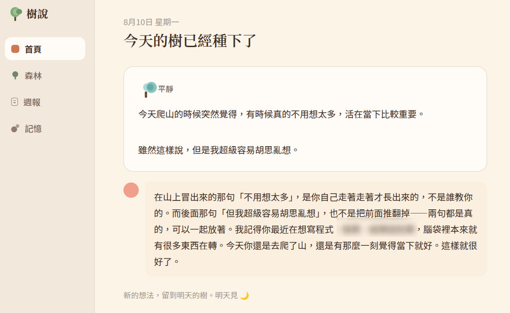
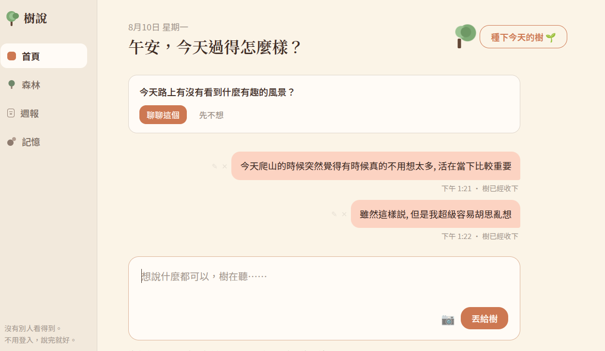
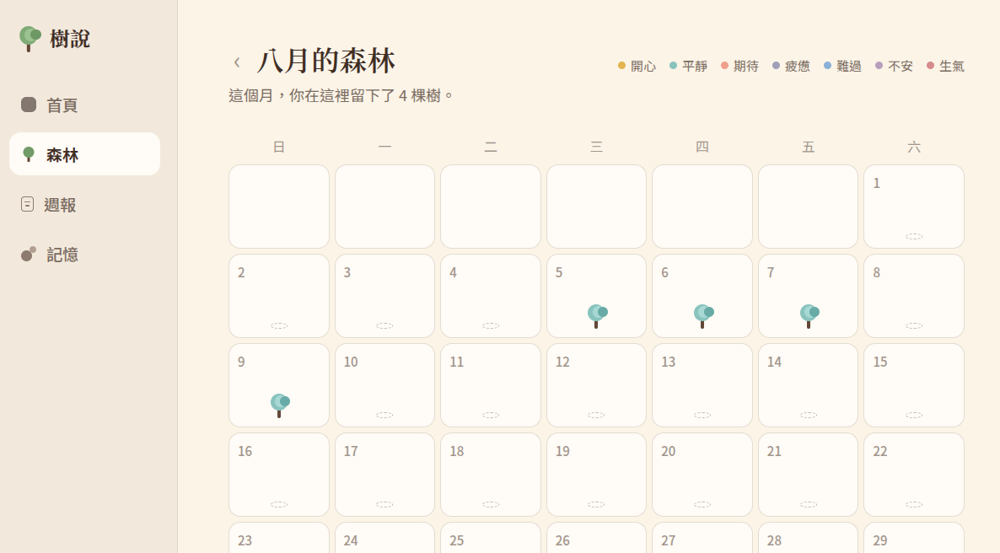
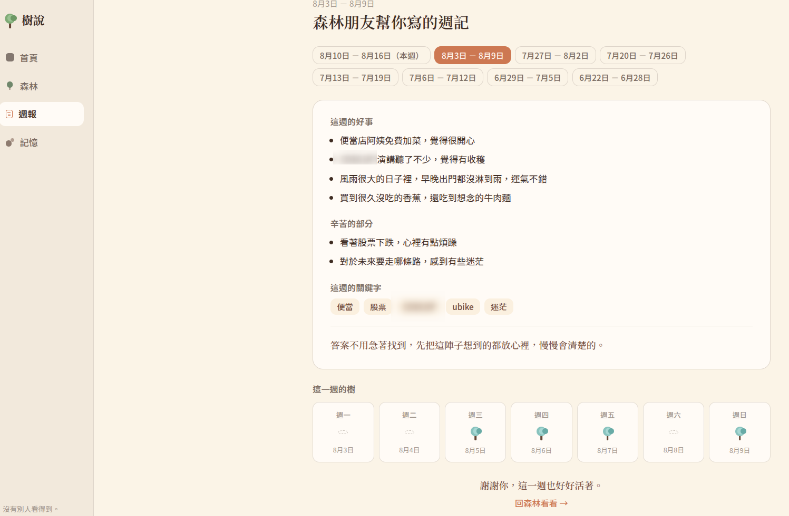
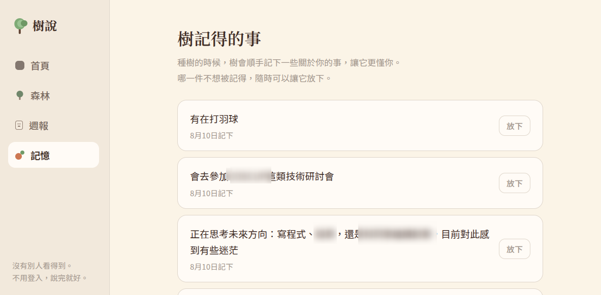

# 樹說（TreeSay）🌳

[](https://www.python.org/)
[](https://fastapi.tiangolo.com/)
[](https://www.sqlite.org/)
[](https://vuejs.org/)
[](https://www.typescriptlang.org/)

[](https://claude.com/claude-code)

單人本機、無登入的療癒日記 Web App。像傳訊息一樣把想法丟給「樹」，
AI 整理成日記並溫暖回覆。

命名取「訴說」諧音——把心事說給樹聽。

**核心定位：一個安靜聽你說、替你把一天收好的傾聽者。**

白天把碎片隨手丟給樹，晚上按一個鍵，它替你長成一篇日記——

「做了很多，但說不出今天做了什麼」的那種日子，就是它想接住的東西。

不評價、不打分、不算連續天數。



## 這個 App 怎麼運作

- **今日**——白天隨手丟訊息，晚上按「種下今天的樹」，AI 一次整理成日記、判定情緒、寫下回覆
- **森林**——月曆檢視，每一天是一棵依情緒長成的樹
- **週報**——已結束的一週可生成回顧，當週顯示「這週還在生長中」
- **記憶**——樹長期記著一些關於你的事，讓回覆接得上前面的日子；每一條你都看得到、刪得掉

那天忘記按「種下今天的樹」也沒關係：那些話不會消失，森林上會留一道淡淡的土壤痕跡，
點進去看得到自己說過什麼，**48 小時內（昨天、前天）還能把那棵樹補種下去**。

再更早的日子就過期了——訊息一樣讀得到，只是不會再長出樹來。

這個窗口刻意留得短。有些日子就是沒有收尾，那也沒關係；如果每一天都能回頭填滿，
森林就變成一張要交的作業，而不是真的發生過什麼。

## 畫面

| 今日 | 森林 |
|---|---|
|  |  |

| 週報 | 記憶 |
|---|---|
|  |  |

## 前置需求

> [!IMPORTANT]
> 這個專案透過你本機的 `claude` CLI 呼叫 AI，**走你自己的 Claude 訂閱額度**。
> 每個使用者都要自己安裝並登入 Claude Code，程式不使用也不需要 API key。
> 這也表示它只能跑在你自己的電腦上，不適合部署成公開服務。

| 需求 | 版本 | 說明 |
|---|---|---|
| Python | 3.13+ | 後端 |
| Node.js | >=24.12 | 前端 build |
| [Claude Code](https://claude.com/claude-code) | 已登入 | AI 生成日記與週報 |

確認 claude CLI 可用：

```bash
claude auth status    # 應顯示 "loggedIn": true
```

沒登入的話執行 `claude auth login`。

## 安裝

```bash
git clone https://github.com/twtrubiks/treesay && cd treesay

# 後端
python -m venv .venv && source .venv/bin/activate
pip install -r backend/requirements.txt

# 前端（build 一次即可，之後啟動不需要 Node）
cd frontend && npm install && npm run build && cd ..
```

## 啟動

```bash
cd backend && python main.py
```

打開 http://127.0.0.1:8000 就是完整的 App——後端會直接提供前端頁面，
不需要另外啟動 dev server。

啟動時若 claude CLI 沒安裝或沒登入，終端機會提示；此時仍可瀏覽既有日記，
只是種樹與週報會失敗。

## 你的資料在哪

> [!IMPORTANT]
> **「本機」指的是儲存，不是 AI。** 日記與照片只存在你的磁碟上，沒有帳號、
> 沒有伺服器保管、沒有其他使用者看得到。但按下「種下今天的樹」或產生週報時，
> 當天的訊息／日記內容會經由 `claude -p` **送到 Anthropic** 才生成回覆，
> 適用你的 Claude 方案的資料政策。
>
> 也就是說：不會有別人讀到你的日記，但它不是完全不出門。要連這段都留在本機，
> 得改接本機模型（目前不支援）。

日記預設存在 `~/.treesay/`：

```
~/.treesay/
├── treesay.db     # 所有日記與週報
└── photos/        # 訊息附的相片
```

可用環境變數改變落點：

```bash
TREESAY_DATA_DIR=/path/to/somewhere python main.py
```

## 用掉多少額度

AI 走你自己的 Claude 訂閱額度。

用量比想像的少：**一天一次種樹，一週一次週報**

每個用途各自挑檔次，不是一律最貴的：

| 用途 | 預設模型 | effort |
|---|---|---|
| 種樹（日記＋樹的回覆） | `claude-opus-5` | `medium` |
| 週報 | `claude-sonnet-5` | `medium` |

覺得不合用就自己調（effort 可填 `low`、`medium`、`high`、`xhigh`）：

```bash
TREESAY_PLANT_MODEL=claude-sonnet-5 TREESAY_PLANT_EFFORT=low python main.py
TREESAY_WEEKLY_MODEL=claude-haiku-4-5 python main.py
```

這樣只有這次啟動生效。想固定下來就寫進 shell 設定（`~/.zshrc`、`~/.bashrc`）：

```bash
export TREESAY_PLANT_MODEL=claude-sonnet-5
export TREESAY_PLANT_EFFORT=low
```

啟動時終端機會印一行實際生效的檔次（`🌳 AI 檔次：plant=... / ...`），可以確認
覆寫有沒有吃到。effort 打錯字會退回預設並在終端機提醒，不會變成種樹失敗。

**備份**——日記是不可再生的資料。完整匯出：

```bash
curl -OJ http://127.0.0.1:8000/api/export     # 存成 treesay-YYYYMMDD.json
```

也可以直接用瀏覽器開 `/api/export` 下載。相片不含在 JSON 裡（只記檔名），
完整備份請連同 `~/.treesay/photos/` 一起複製。

## 開發

前端改動想要熱重載時，用 vite dev server（會 proxy `/api` 到後端）：

```bash
cd backend && python main.py         # 後端 :8000
cd frontend && npm run dev           # 前端 :5173，開這個
```

測試：

```bash
pip install -r backend/requirements-dev.txt
cd backend && pytest
```

## 技術棧

- **後端**：FastAPI ＋ SQLAlchemy ＋ SQLite（uvicorn 僅綁 `127.0.0.1`）
- **前端**：Vue 3 ＋ Vite ＋ TypeScript ＋ Pinia
- **AI**：本機 `claude -p --output-format json`（async subprocess）

設計文件見 [`docs/plans/`](docs/plans/)。

## 授權

[MIT](LICENSE)

## Donation

文章都是我自己研究內化後原創，如果有幫助到您，也想鼓勵我的話，歡迎請我喝一杯咖啡 :laughing:

綠界科技ECPAY ( 不需註冊會員 )


[贊助者付款](http://bit.ly/2F7Jrha)

歐付寶 ( 需註冊會員 )


[贊助者付款](https://payment.opay.tw/Broadcaster/Donate/9E47FDEF85ABE383A0F5FC6A218606F8)

## 贊助名單

[贊助名單](https://github.com/twtrubiks/Thank-you-for-donate)
